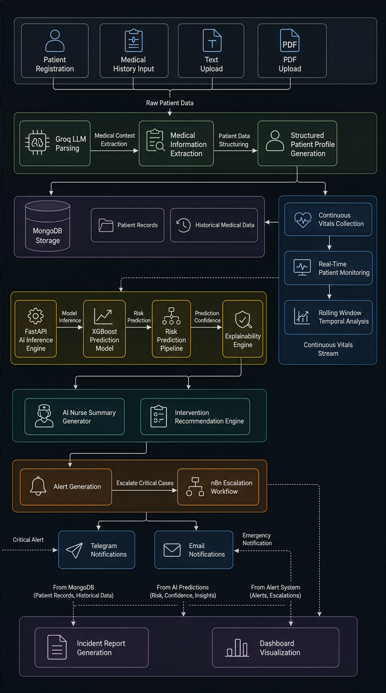
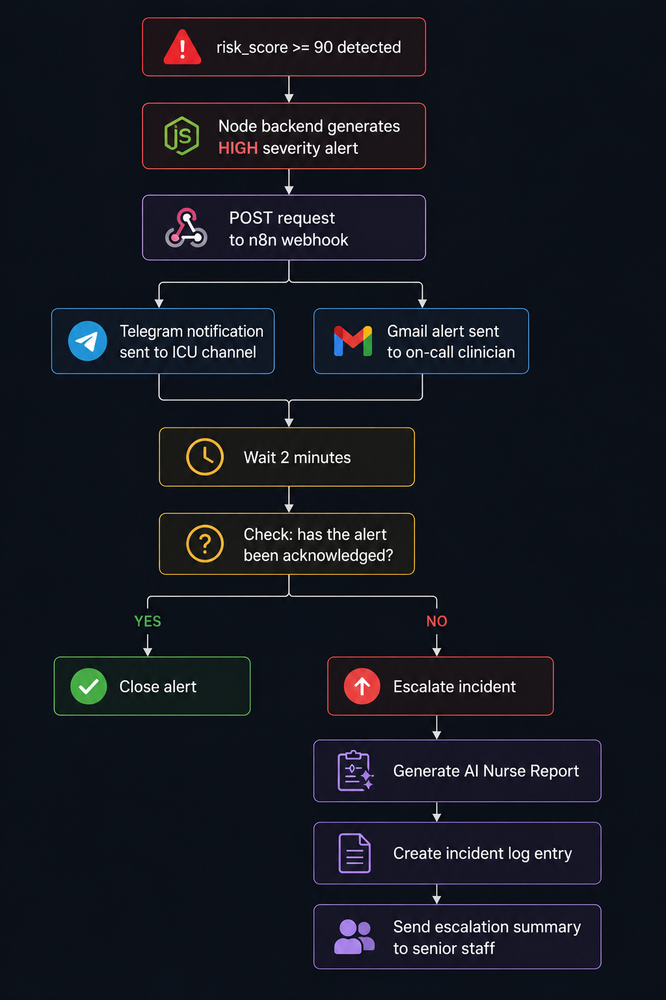

<div align="center">

<br/>

```
███████╗███████╗███╗   ██╗████████╗██████╗ ██╗
██╔════╝██╔════╝████╗  ██║╚══██╔══╝██╔══██╗██║
███████╗█████╗  ██╔██╗ ██║   ██║   ██████╔╝██║
╚════██║██╔══╝  ██║╚██╗██║   ██║   ██╔══██╗██║
███████║███████╗██║ ╚████║   ██║   ██║  ██║██║
╚══════╝╚══════╝╚═╝  ╚═══╝   ╚═╝   ╚═╝  ╚═╝╚═╝
```

**Autonomous ICU Deterioration Monitoring and Clinical Escalation Platform**

<br/>

[](https://sentri-ll6c.vercel.app/)
[](https://sentri-simu.vercel.app/)
[](https://loyal-magic-production-0fce.up.railway.app/)
[](https://sentri-production.up.railway.app/)

<br/>

[](https://xgboost.readthedocs.io/)
[](https://fastapi.tiangolo.com/)
[](https://nextjs.org/)
[](https://www.mongodb.com/atlas)
[](https://n8n.io/)
[](LICENSE)


</div>

---

## Table of Contents

- [The Problem](#the-problem)
- [What Sentri Does Differently](#what-sentri-does-differently)
- [Live Deployments](#live-deployments)
- [System Architecture](#system-architecture)
- [Repository Structure](#repository-structure)
- [ML Pipeline](#ml-pipeline)
- [n8n Escalation Workflow](#n8n-escalation-workflow)
- [Dashboard Features](#dashboard-features)
- [API Reference](#api-reference)
- [Demo Scenario](#demo-scenario)
- [Local Development](#local-development)
- [Tech Stack](#tech-stack)
- [Engineering Principles](#engineering-principles)
- [Known Issues and Fixes](#known-issues-and-fixes)
- [Disclaimer](#disclaimer)

---

## The Problem

Sepsis is one of the most time-critical conditions in medicine. According to the Surviving Sepsis Campaign, every hour of delayed treatment increases mortality by an estimated 7%. Yet in Indian ICUs, a single nurse routinely monitors 8 to 10 patients simultaneously, relying on monitoring equipment that has not fundamentally changed in decades.

Today's bedside monitoring systems operate on **static threshold alerts**: a buzzer fires when heart rate exceeds 120, or temperature exceeds 38°C. These rules are blunt instruments. They treat every crossing of a threshold as an alarm-worthy event, regardless of whether the patient's condition is genuinely deteriorating or simply fluctuating within normal physiological variance. The result is well-documented in clinical literature: **alert fatigue**. Nursing staff begin to tune out alarms because the overwhelming majority are false positives, and by the time a real deterioration event is severe enough to trigger a classical threshold alert, the treatment window has often already narrowed.

Sentri is built on a different premise: **gradual physiological deterioration leaves a trend signature long before any individual threshold is crossed.** A patient whose heart rate climbs from 78 to 84 to 91 over 30 minutes is telling a story that a snapshot-based system will never hear. Sentri listens for that story.

---

## What Sentri Does Differently

Sentri is not a diagnostic system and does not make clinical conclusions. It is an **AI-assisted early warning and clinical decision support platform** that surfaces risk earlier, explains its reasoning in plain language, and automates escalation so that the right people are informed at the right time.

| Dimension | Traditional Monitoring | Sentri |
|---|---|---|
| Detection method | Single-point threshold checks | Rolling temporal trend analysis across 6-reading windows |
| Alert trigger | `HR > 120` | `HR slope +2 bpm/min sustained across multiple cycles` |
| Patient context | None | Vitals fused with structured medical history (diabetes, hypertension, age, BMI) |
| Explainability | Black-box alarm | SHAP attribution: *"Heart rate rising steadily, SpO2 decreasing, patient has diabetes"* |
| Alert fatigue | High; every threshold breach fires | Persistence checks, cooldown logic, and acknowledgement workflows |
| Information delivered | A beep or a colored bar | Risk score, trend graph, AI clinical summary, and prioritised intervention list |
| Escalation | Manual nurse-to-doctor communication | Automated n8n workflow: Telegram, Gmail, 2-minute ACK check, incident escalation |

---

## Live Deployments

All services are deployed and publicly accessible. No setup is required to explore the platform.

| Service | URL | Infrastructure |
|---|---|---|
| **Main Dashboard** | [sentri-ll6c.vercel.app](https://sentri-ll6c.vercel.app/) | Next.js on Vercel |
| **Simulation Dashboard** | [sentri-simu.vercel.app](https://sentri-simu.vercel.app/) | Next.js on Vercel |
| **Node.js Backend** | [loyal-magic-production-0fce.up.railway.app](https://loyal-magic-production-0fce.up.railway.app/) | Express on Railway |
| **FastAPI AI Service** | [sentri-production.up.railway.app](https://sentri-production.up.railway.app/) | FastAPI on Railway |
| **Database** | MongoDB Atlas | Cloud-hosted, multi-region |
| **Workflow Automation** | n8n Cloud | Self-hostable alternative available |

---

## System Architecture

The platform is composed of four independently deployable services that communicate over well-defined REST and WebSocket contracts.

<div align="center">



<br/>
<br/>

<em>
AI-powered healthcare monitoring and triage architecture showing patient intake,
medical parsing, temporal monitoring, AI inference, explainability,
clinical intelligence, alert escalation, and reporting layers.
</em>

</div>


## Repository Structure

```
sentri/
│
├── ai-backend/                        # FastAPI ML inference service
│   ├── app/
│   │   ├── main.py                    # Application entrypoint and route registration
│   │   ├── feature_engineering.py     # 28-feature temporal extraction pipeline
│   │   ├── predictor.py               # XGBoost inference and exponential smoothing
│   │   ├── explanations.py            # SHAP attribution and rule-based explainability
│   │   ├── model_loader.py            # Pickle model and feature column loader
│   │   ├── schemas.py                 # Pydantic request/response models
│   │   └── utils.py                   # Shared utility functions
│   ├── models/
│   │   ├── sentri_xgboost_model.pkl   # Trained XGBoost classifier
│   │   └── feature_columns.pkl        # Feature column ordering for inference
│   ├── requirements.txt
│   ├── Procfile                        # Railway deployment config
│   └── runtime.txt
│
├── node_backend/                      # Express.js orchestration layer
│   ├── src/
│   │   ├── config/
│   │   │   └── db.js                  # MongoDB Atlas connection setup
│   │   ├── controllers/               # Route handler functions
│   │   │   ├── vitalController.js     # Vital ingestion and retrieval
│   │   │   ├── patientController.js   # Patient registration and history
│   │   │   ├── predictionController.js
│   │   │   ├── alertController.js     # Alert lifecycle management
│   │   │   ├── aiSummaryController.js # Nurse summary generation
│   │   │   └── dashboardController.js # Aggregated dashboard state
│   │   ├── models/                    # Mongoose schemas
│   │   │   ├── Patient.js
│   │   │   ├── Vitals.js
│   │   │   ├── Prediction.js
│   │   │   └── Alert.js
│   │   ├── routes/                    # Express router definitions
│   │   ├── services/                  # Business logic layer
│   │   │   ├── aiService.js           # FastAPI /predict integration
│   │   │   ├── alertService.js        # Persistence, cooldown, ACK logic
│   │   │   ├── aiSummaryService.js    # Nurse summary orchestration
│   │   │   └── geminiService.js       # LLM fallback integration
│   │   ├── middleware/
│   │   │   └── errorMiddleware.js
│   │   └── utils/
│   │       ├── historySchema.js       # Structured history shape
│   │       └── prompts.js             # Groq LLM prompt templates
│   ├── server.js                      # Entry point — dotenv must load first
│   ├── API_DOC.md
│   └── package.json
│
├── main_dashboard/                    # Clinical monitoring dashboard
│   ├── app/
│   │   ├── dashboard/page.tsx         # Primary ICU monitoring view
│   │   └── page.tsx                   # Public-facing landing page
│   ├── components/
│   │   ├── hero/                      # Landing page hero section
│   │   ├── overview/                  # Problem and solution overview
│   │   ├── technology/                # Architecture and stack visualizations
│   │   └── shared/                    # Button, Panel, SectionHeader primitives
│   ├── styles/                        # Design token system (CSS custom properties)
│   └── backend/api.ts                 # Typed Node backend client
│
├── simulation_dashboard/              # Real-time vitals simulation frontend
│   ├── app/page.jsx                   # Main simulation view
│   ├── src/
│   │   ├── components/
│   │   │   ├── VitalsMonitor.jsx      # Top-level monitor component
│   │   │   ├── WaveformChannel.jsx    # ECG-style scrolling waveform
│   │   │   ├── VitalPanel.jsx         # Individual vital with alarm color coding
│   │   │   ├── PatientSelector.jsx    # Patient switching control
│   │   │   ├── Header.jsx
│   │   │   └── StatusBar.jsx
│   │   ├── hooks/
│   │   │   └── useVitalsSimulator.js  # Simulation engine and scenario queue
│   │   └── lib/
│   │       ├── dataLoader.js          # PhysioNet CSV reader
│   │       ├── api.js                 # Node backend client
│   │       └── waveformUtils.js       # Waveform interpolation helpers
│   └── public/
│       └── Simulated_Dataset.csv      # PhysioNet calibration data
│
└── README.md
```

---

## ML Pipeline

> The intelligence in Sentri lives in feature engineering and trend detection, not model complexity. A well-engineered feature set feeding a gradient boosted classifier consistently outperforms deep learning approaches on tabular ICU data with high class imbalance.

### 1. Rolling Window Temporal Analysis

Every prediction is derived from the **six most recent vital sign readings**, forming a sliding temporal window that captures the direction and acceleration of physiological change over time rather than measuring isolated snapshots.

```
Readings:   V1   V2   V3   V4   V5   V6   V7   V8
            ─────────────────────────────────────────────
Window 1:  [V1   V2   V3   V4   V5   V6]              Prediction 1
Window 2:       [V2   V3   V4   V5   V6   V7]         Prediction 2
Window 3:            [V3   V4   V5   V6   V7   V8]    Prediction 3
```

The system enters a warm-up state for the first five readings, mirroring real ICU monitoring protocols where calibration data must be established before alerts are considered valid.

### 2. Feature Engineering — 28 Temporal Features

For each vital sign, Sentri extracts five temporal descriptors from the current window. These features capture not just where the patient is, but where they are going and how fast.

```python
# Slope detection via linear regression captures trend direction
slope, _ = np.polyfit(range(len(window)), values, deg=1)

# Acceleration captures the rate of change of slope
acceleration = slope_current - slope_previous

# Baseline deviation captures how far the patient has shifted
# from their personal admission baseline
delta_from_baseline = current_value - patient_baseline
```

**Features extracted per vital sign:**

```
Heart Rate:         hr_mean, hr_std, hr_slope, hr_acceleration, hr_above_baseline
Oxygen Saturation:  spo2_mean, spo2_std, spo2_slope, spo2_acceleration
Temperature:        temp_mean, temp_slope, temp_acceleration
Respiratory Rate:   resp_mean, resp_slope, resp_acceleration
Blood Pressure:     sbp_mean, map_mean, sbp_above_baseline

Patient History:    age, age_60_plus, diabetes, smoker,
                    heart_disease, kidney_disease, bmi, baseline_hr
```

Total: **28 engineered features** per prediction window.

### 3. XGBoost Classifier

The model was trained on 461,781 windowed samples derived from 546,123 raw ICU readings sourced from the PhysioNet sepsis dataset. The dataset exhibits severe class imbalance (97.7% stable, 2.3% sepsis), which is addressed via `scale_pos_weight`.

```python
model = XGBClassifier(
    n_estimators=200,
    max_depth=7,
    learning_rate=0.04,
    subsample=0.8,
    colsample_bytree=0.8,
    scale_pos_weight=42.64,    # 451,200 stable / 10,581 sepsis
    eval_metric="logloss",
    random_state=42
)
```

**Performance on held-out test set (80/20 stratified split):**

| Metric | Score | Notes |
|---|---|---|
| Accuracy | 0.872 | |
| ROC AUC | **0.894** | Primary optimization target |
| Recall (Sepsis class) | **0.717** | Prioritised over precision |
| F1 Score (Sepsis class) | 0.205 | Expected given class imbalance |

Recall is deliberately prioritised over precision in this domain. A false negative (missed sepsis) carries a far greater cost than a false positive (unnecessary clinical review).

### 4. Risk Score Smoothing

Raw XGBoost probabilities are post-processed through exponential smoothing before being surfaced on the dashboard. This prevents noisy probability estimates from producing jarring visual spikes that could mislead clinical staff or erode trust in the system.

```python
def smooth_risk_scores(scores: list[float], alpha: float = 0.25) -> list[float]:
    """
    Exponential moving average over raw prediction probabilities.
    alpha=0.25 balances responsiveness to genuine deterioration
    with stability against physiological noise.
    """
    smoothed, previous = [], scores[0]
    for score in scores:
        current = alpha * score + (1 - alpha) * previous
        smoothed.append(current)
        previous = current
    return smoothed
```

### 5. Explainability via SHAP

Every prediction is accompanied by a ranked list of the top contributing features, translated into plain clinical language. This is the mechanism that separates Sentri from a black-box alert system and is central to its value proposition for clinical staff.

```python
# Example SHAP output translated to human-readable factors
{
  "top_factors": [
    "Heart rate rising steadily",
    "Oxygen saturation decreasing",
    "Patient has diabetes, elevating baseline risk"
  ]
}
```

### 6. AI Nurse Summary

The Groq LLM (Llama 3) receives the latest vitals, prediction score, trend direction, and SHAP explanations and generates a concise clinical summary written for nursing handoff. This is strictly a communication aid and does not contain diagnostic conclusions.

```
Example output:
"Patient condition appears to be worsening over the last 20 minutes,
with increasing heart rate, declining oxygen saturation, and elevated
respiratory rate. Current deterioration risk is classified as high.
Immediate clinical evaluation is recommended."
```

### 7. Risk Thresholds and Color Mapping

| Score Range | Severity | Color Code | Recommended Action |
|---|---|---|---|
| 0 to 30 | `low` | `#00ff7f` (green) | Continue standard monitoring |
| 30 to 60 | `moderate` | `#ffaa00` (amber) | Increase check frequency |
| 60 to 100 | `high` | `#ff3333` (red) | Immediate clinical evaluation |

> **Implementation note:** The severity string returned by the backend is `"moderate"`, not `"medium"`. Incorrect string matching was a real bug in this codebase and has been corrected across all frontend components.

---

## n8n Escalation Workflow

When `risk_score >= 90`, Sentri triggers an automated escalation pipeline orchestrated through n8n. This workflow simulates the kind of autonomous incident management that would be expected in a production clinical environment, where a missed acknowledgement must automatically escalate to senior staff.


<div align="center">



<br/>
<br/>

<em>
Automated escalation workflow with Telegram alerts, Gmail notifications,
acknowledgement checks, incident escalation, and AI-generated nurse reporting.
</em>

</div>

**Alert payload sent to n8n:**

```json
{
  "patient_id": "P1001",
  "patient_name": "John Doe",
  "risk_score": 82,
  "severity": "high",
  "is_acknowledged": false,
  "latest_vitals": {
    "heart_rate": 132,
    "spo2": 88,
    "temperature": 39.1,
    "respiratory_rate": 30
  },
  "explanations": [
    "Heart rate rising steadily",
    "Oxygen saturation decreasing",
    "Respiratory distress worsening"
  ]
}
```

> **Deployment note:** The `N8N_WEBHOOK_URL` environment variable must be set as a clean URL with no surrounding quotes and no trailing semicolon. Both have caused production failures and are documented in the known issues section below.

---

## Dashboard Features

Sentri ships two separate frontend applications serving different purposes.

### Simulation Dashboard

The simulation dashboard is designed for live demonstrations and technical evaluation. It presents a clinical ICU monitor aesthetic (inspired by Philips IntelliVue hardware) and runs a configurable scenario queue that automatically progresses through `stable → moderate deterioration → septic shock` at a compressed timescale, where one second of wall clock time can represent several minutes of patient time.

Key components:

- `VitalsMonitor` — top-level state container and Socket.io client
- `WaveformChannel` — ECG-style scrolling waveform rendered via Recharts
- `VitalPanel` — individual vital display with alarm color coding based on current severity
- `PatientSelector` — multi-patient switching with risk-sorted ordering
- `useVitalsSimulator` — simulation engine hook managing scenario progression and timing

### Main Dashboard

The main dashboard is the primary clinical interface. It implements a lightweight role toggle between a **Nurse View** and a **Doctor View** rather than full RBAC, keeping the scope appropriate for a hackathon context while demonstrating the design intent.

**Nurse View** is optimised for operational speed:
- Patient list sorted by current risk score, highest first
- Live vital values with alarm color indicators
- Alert banners with acknowledged/unacknowledged state
- Current risk score badge per patient

**Doctor View** is optimised for clinical depth:
- Risk score trend graph over the monitoring session
- Patient history summary (structured from LLM-parsed PDF)
- SHAP explainability panel showing top contributing factors
- Full alert timeline with timestamps
- Intervention recommendations panel

---

## API Reference

### Node.js Backend Endpoints

| Method | Endpoint | Description |
|---|---|---|
| `POST` | `/vitals` | Ingest a new vital sign reading for a patient |
| `GET` | `/patient/:id/vitals` | Retrieve stored vitals history for a patient |
| `POST` | `/upload-history` | Upload a medical history PDF or text document |
| `GET` | `/patient/:id/history` | Retrieve structured history features for a patient |
| `GET` | `/patient/:id/risk` | Get the most recent risk prediction |
| `GET` | `/alerts` | List all active and recent alerts |
| `POST` | `/alerts/:id/acknowledge` | Mark an alert as acknowledged |
| `GET` | `/patient/:id/summary` | Get the latest AI Nurse summary for a patient |

### FastAPI AI Service

**`POST /predict`**

```json
// Request body
{
  "patient_id": "P001",
  "vitals": [
    {
      "heart_rate": 92,
      "spo2": 97,
      "temperature": 37.2,
      "respiratory_rate": 18,
      "mean_arterial_pressure": 85,
      "systolic_bp": 118
    }
  ],
  "history_features": {
    "age": 64,
    "age_60_plus": 1,
    "diabetes": 1,
    "hypertension": 1,
    "heart_disease": 0,
    "kidney_disease": 0,
    "smoker": 0,
    "bmi": 27.4,
    "baseline_hr": 75,
    "baseline_sbp": 122
  }
}
```

```json
// Response body
{
  "risk_score": 78,
  "severity": "high",
  "top_factors": [
    "Heart rate rising steadily",
    "Oxygen saturation decreasing",
    "Patient has diabetes"
  ],
  "nurse_summary": "Patient condition appears to be worsening over the last 20 minutes...",
  "interventions": [
    "Review oxygen support",
    "Increase monitoring frequency",
    "Assess respiratory distress"
  ]
}
```

**Critical field name requirements:**

The backend expects and returns exact field names. The following mismatches caused real integration failures during development and are documented here to prevent recurrence:

| Correct field name | Incorrect variant that caused bugs |
|---|---|
| `respiratory_rate` | `resp_rate` |
| `mean_arterial_pressure` | `map` |
| `"moderate"` (severity string) | `"medium"` |

---

## Test Patients

Three pre-configured patient profiles are available to validate the system end-to-end.

| Patient ID | Clinical Profile | Expected Risk Level |
|---|---|---|
| `P_CRIT_100` | Critical septic shock. Elderly, diabetic. HR 132, SpO2 88%, Temp 39.1°C, RR 30. | HIGH (red) |
| `P_MED_200` | Moderate early deterioration. Rising HR trend, borderline SpO2, mild fever. | MODERATE (amber) |
| `P_STABLE_300` | Stable post-operative recovery. Normal vitals, improving or flat trends. | LOW (green) |

---

## Demo Scenario

The simulation dashboard executes a compressed-time deterioration timeline purpose-built for live presentations. The scenario is designed so that a judge watching the screen can observe a complete sepsis early warning cycle within approximately 8 to 10 minutes.

```
T+01:00   Patient stable. HR 72, SpO2 98%, Temp 37.0, RR 14.        [LOW]
T+03:00   Heart rate begins climbing. Computed slope: +1.8 bpm/min.  [LOW to MODERATE]
T+05:00   SpO2 begins declining. Respiratory rate increasing.        [MODERATE]
T+06:00   Risk score crosses 60. SHAP surfaces HR and SpO2 trends.  [MODERATE to HIGH]
T+07:00   Risk score reaches 90. Alert generated. n8n triggered.    [HIGH]
T+07:30   Telegram notification delivered. Gmail alert sent.
T+09:30   2-minute acknowledgement window expires unacknowledged.
          Incident escalated. AI Nurse Report generated and logged.
```

---

## Local Development

### Prerequisites

- Node.js 18 or higher
- Python 3.10 or higher
- A MongoDB Atlas cluster URI (or local MongoDB instance)
- A Groq API key (free tier is sufficient for development)
- npm and pip

### 1. Clone the Repository

```bash
git clone https://github.com/your-org/sentri.git
cd sentri
```

### 2. Node.js Backend

```bash
cd node_backend
npm install
cp .env.example .env
```

Populate `.env` with your credentials:

```env
PORT=5000
MONGO_URI=your_mongodb_connection_string
GROQ_API_KEY=your_groq_api_key
AI_BACKEND_URL=http://localhost:8080/predict
N8N_WEBHOOK_URL=https://your-n8n-instance.app.n8n.cloud/webhook/sentri-alert
```

> `require("dotenv").config()` must appear as the **first statement** in `server.js`, before any module imports. Placing it after imports will result in `GROQ_API_KEY` and other variables reading as `undefined`.

```bash
npm run dev
# Starts on http://localhost:5000
```

### 3. FastAPI AI Backend

```bash
cd ai-backend
python -m venv venv

# macOS / Linux
source venv/bin/activate

# Windows
venv\Scripts\activate

pip install -r requirements.txt
uvicorn app.main:app --host 0.0.0.0 --port 8080 --reload
# API available at http://localhost:8080
# Interactive docs at http://localhost:8080/docs
```

### 4. Main Dashboard

```bash
cd main_dashboard
npm install
npm run dev
# Starts on http://localhost:3000
```

### 5. Simulation Dashboard

```bash
cd simulation_dashboard
npm install
npm run dev
# Starts on http://localhost:3001
```

---

## Tech Stack

| Layer | Technology | Purpose |
|---|---|---|
| Frontend | Next.js 15, React, Tailwind CSS, Recharts | Dashboard and simulation UI |
| Real-time transport | Socket.io | Live vitals push from backend to browser |
| Backend orchestration | Node.js, Express.js | API gateway, alert logic, DB writes, n8n dispatch |
| AI inference service | Python, FastAPI, Uvicorn | Feature engineering, ML inference, explainability |
| Machine learning | XGBoost, SHAP, Scikit-learn | Sepsis risk prediction and attribution |
| Data processing | Pandas, NumPy | Rolling window feature extraction |
| LLM integration | Groq API (Llama 3) | Medical history parsing and nurse summary generation |
| Database | MongoDB Atlas, Mongoose | Persistent storage for vitals, predictions, alerts |
| Workflow automation | n8n | Alert escalation orchestration |
| Notifications | Telegram Bot API, Gmail API | Multi-channel clinical alerting |
| Deployment | Vercel, Railway, MongoDB Atlas, n8n Cloud | Fully cloud-native hosting |

---

## Engineering Principles

This project was built under deliberate architectural constraints to deliver a credible, integrated system within a 48-hour hackathon window. The principles below reflect the trade-offs made and the reasoning behind each decision.

**Feature engineering over model complexity.** A carefully engineered feature set — slopes, accelerations, baseline deltas — provides more signal for tabular ICU data than a deep learning model would. The intelligence in Sentri is in how the data is transformed, not in the depth of the network.

**Explainability is a first-class requirement.** SHAP attribution values are not a bonus feature. They are core to the clinical use case. A nurse who cannot understand why an alert fired will not trust the system. The entire explainability pipeline was built before the dashboard, not after.

**The Python AI backend is fully decoupled.** The FastAPI service exposes a single `POST /predict` endpoint and has no knowledge of MongoDB, Socket.io, or the dashboard. This means it can be tested, iterated on, and redeployed independently. Any orchestration logic lives exclusively in the Node.js layer.

**API contracts were defined before parallel development began.** Both frontend and backend developers worked against a shared, committed contract document from day one. This eliminated blocking dependencies and allowed the simulation dashboard and AI service to be developed concurrently without integration surprises.

**Exponential smoothing protects the user experience.** Raw XGBoost probability outputs are noisy. Without smoothing (`alpha=0.25`), the risk gauge on the dashboard would jitter in ways that would undermine clinical confidence. This is not a cosmetic choice — it is a trust and usability decision.

**No overengineering.** There is no LangChain agent, no LSTM, no Kubernetes cluster, no service mesh. Every architectural decision was evaluated against the question: does this make the demo better, or does it just make the architecture diagram more impressive?

---

## Known Issues and Fixes

This section documents integration failures encountered during development and the resolutions applied. It is preserved here because the debugging process represents real engineering judgment.

| Symptom | Root Cause | Resolution |
|---|---|---|
| Moderate risk patients displayed green on dashboard | Frontend severity check used `"medium"` but backend returns `"moderate"` | Updated all conditional branches to check for `"moderate"` |
| Vitals emitting at incorrect rate | `useCallback` hook depended on `scenarioQueue`, causing interval recreation on each state update | Changed dependency array to `[]` to stabilise the interval |
| Double-slash appearing in API request URLs | `BASE_URL` constant included a trailing slash and endpoint paths began with `/` | Removed trailing slash from the base URL constant |
| FastAPI returning 422 Unprocessable Entity | Frontend was sending `null` for optional history fields | Applied `field ?? 0` fallback before serialisation |
| n8n webhook calls failing silently | Railway environment variable was set with surrounding quotes and a trailing semicolon | Set the variable as a bare URL string with no surrounding characters |
| `ReferenceError: axios is not defined` | `axios` was used in a controller without being imported | Added `const axios = require("axios")` at the top of the affected file |
| `GROQ_API_KEY` reading as `undefined` at runtime | `require("dotenv").config()` was called after other module imports had already executed | Moved the dotenv initialisation to the first line of `server.js` |

---

## Disclaimer

Sentri is an educational and demonstration project developed for a student hackathon competition. It is not a certified medical device, has not been validated for clinical use, and does not constitute medical advice of any kind. The intervention recommendations generated by the system are informational in nature and are intended to illustrate how AI-assisted decision support tooling might surface monitoring priorities in a real ICU environment. No clinical decision should ever be made based on output from this system.

---

## Team

**Team H2Edge** — NMIT Hacks Hackathon 2026
Nitte Meenakshi Institute of Technology, Bengaluru, India

---

<div align="center">

<br/>

**[View the Live Platform](https://sentri-ll6c.vercel.app/)**

*Built with care. In the ICU, every minute matters.*

<br/>

</div>